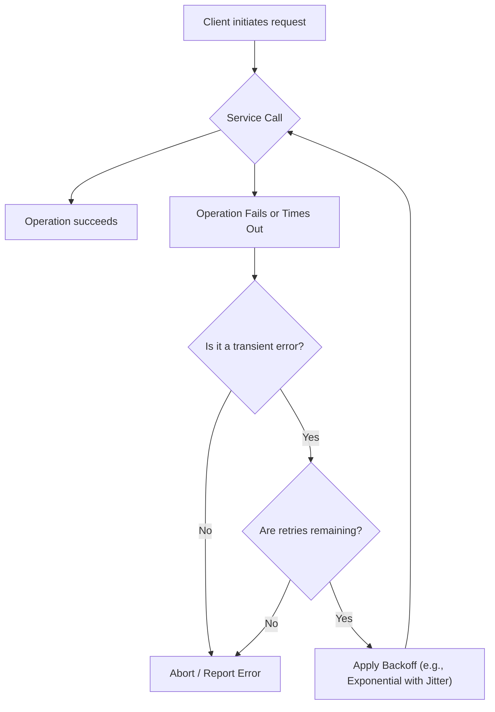

## Timeouts & Retry Patterns
### Core Concepts

*   **Timeouts:** A mechanism to terminate an operation if it doesn't complete within a specified duration.
    *   **Purpose:** Prevents indefinite waiting, resource exhaustion (threads, connections), and cascading failures. It enforces "fail-fast" behavior.
*   **Retry Patterns:** A strategy to re-attempt an operation that has previously failed, assuming the failure is transient.
    *   **Purpose:** Improves reliability by overcoming temporary issues (e.g., network glitches, brief service unavailability, transient resource contention).

### Key Details & Nuances

*   **Timeouts:**
    *   **Types:**
        *   **Connection Timeout:** Time to establish a network connection.
        *   **Read/Write (Socket) Timeout:** Time for data transfer to complete once a connection is established.
        *   **Request/Operation Timeout:** End-to-end time for a complete operation, often encompassing connection and read/write.
    *   **Configuration:** Timeouts should be configured at multiple layers: client-side, server-side (for external calls), load balancers, API gateways, and databases.
    *   **Cascading Timeouts:** Crucial in distributed systems. Upstream services should have timeouts greater than or equal to the sum of their downstream dependencies' timeouts, plus processing time, to avoid clients waiting indefinitely for deeply nested failures.
*   **Retry Patterns:**
    *   **Idempotency:** An operation is idempotent if executing it multiple times produces the same result as executing it once. **Retries should only be applied to idempotent operations** to prevent unintended side effects (e.g., double-charging a customer).
    *   **Backoff Strategies:**
        *   **Fixed Delay:** Simple but can overwhelm a recovering service if many clients retry simultaneously.
        *   **Exponential Backoff:** Increases the delay between retries exponentially (`delay = base * 2^n`, where `n` is retry attempt). Gives the system more time to recover.
        *   **Jitter:** Adds a random variance (e.g., `+/- 25%`) to the calculated exponential backoff delay. This prevents the "thundering herd" problem where many clients retry at the exact same exponential interval, potentially overwhelming the recovering service again.
    *   **Max Retries:** Always define a maximum number of retries to prevent infinite loops and eventual failure.
    *   **Circuit Breaker Pattern:** Complements retries. Prevents repeatedly calling a service that is clearly failing.
        *   **Closed:** Normal operation.
        *   **Open:** If failures exceed a threshold, the circuit "trips" open, and all subsequent calls fail fast without hitting the service.
        *   **Half-Open:** After a cool-down period, a single "test" request is allowed. If successful, the circuit closes; otherwise, it returns to open.
    *   **Retry-After Header:** Services can use the HTTP `Retry-After` header (e.g., `429 Too Many Requests` response) to suggest when a client should retry, guiding backoff strategies.

### Practical Examples

**1. Exponential Backoff with Jitter (TypeScript)**

```typescript
async function callServiceWithRetry(
  operation: () => Promise<any>,
  maxRetries: number,
  baseDelayMs: number = 100 // Initial delay for exponential backoff
): Promise<any> {
  let retries = 0;
  while (retries <= maxRetries) {
    try {
      return await operation();
    } catch (error: any) {
      console.error(`Attempt ${retries + 1}/${maxRetries + 1} failed: ${error.message}`);

      if (retries === maxRetries) {
        throw error; // All retries exhausted, rethrow the last error
      }

      // Exponential backoff with jitter
      const exponentialDelay = baseDelayMs * Math.pow(2, retries);
      const jitter = Math.random() * (exponentialDelay * 0.2); // Up to 20% random variation
      const finalDelay = exponentialDelay + jitter;

      console.log(`Retrying in ${finalDelay.toFixed(0)}ms...`);
      await new Promise(resolve => setTimeout(resolve, finalDelay));
      retries++;
    }
  }
}

// Example usage:
/*
const unstableServiceCall = async () => {
  if (Math.random() > 0.3) { // 70% chance of failure
    throw new Error("Service unavailable temporarily!");
  }
  console.log("Service call successful!");
  return { data: "success" };
};

callServiceWithRetry(unstableServiceCall, 3, 50)
  .then(result => console.log("Final success:", result))
  .catch(error => console.error("Final failure after retries:", error.message));
*/
```

**2. Flow of a Timeout and Retry Operation**



### Common Pitfalls & Trade-offs

*   **Blind Retries:** Retrying operations for non-transient errors (e.g., validation errors like `400 Bad Request`, `401 Unauthorized`, `404 Not Found`) wastes resources and can mask actual issues.
*   **Thundering Herd:** Without jitter, multiple clients retrying simultaneously can re-overwhelm a recovering service.
*   **Insufficient or Overly Long Timeouts:**
    *   **Too Short:** Leads to premature failures, increasing retries for minor delays.
    *   **Too Long:** Holds resources unnecessarily, delaying detection of true failures and potentially leading to resource exhaustion (e.g., thread pools filling up).
*   **Non-Idempotent Operations:** Retrying these can lead to duplicate side effects (e.g., creating duplicate records, processing payments multiple times).
*   **Retry Storms:** Recursive retries in a deeply nested microservices architecture can amplify a small problem into a large-scale outage.
*   **Trade-offs:**
    *   **Latency vs. Reliability:** Retries increase end-to-end latency but improve the probability of eventual success.
    *   **Resource Consumption vs. Fault Tolerance:** More aggressive retries and shorter timeouts (if not balanced) can increase resource consumption on the client side, while well-configured patterns reduce it on the server side during recovery.
    *   **Complexity vs. Robustness:** Implementing sophisticated retry and timeout logic adds complexity to the codebase but significantly enhances system robustness.

### Interview Questions

1.  **Q:** How do timeouts and retries contribute to the overall resilience and stability of a distributed system?
    **A:** Timeouts ensure that a system doesn't wait indefinitely for a failing or slow dependency, preventing resource exhaustion and cascading failures. Retries handle transient faults by re-attempting operations, improving the success rate for operations affected by temporary network issues or service fluctuations. Together, they allow a system to gracefully handle expected failures without user intervention or manual restarts, leading to higher availability and a better user experience.

2.  **Q:** Explain the concept of idempotency in the context of retries. Why is it critical, and when might you use a different approach for non-idempotent operations?
    **A:** Idempotency means that an operation can be performed multiple times without changing the result beyond the initial execution. It's critical for retries because if a non-idempotent operation (e.g., a payment debit) fails *after* its side effect occurs but *before* confirmation is received, retrying it blindly could lead to duplicate side effects. For non-idempotent operations, you might use:
    *   **Distributed Transactions/Two-Phase Commit:** To ensure atomicity.
    *   **Deduplication Logic:** Use unique request IDs to check if an operation was already processed before executing it again.
    *   **Compensating Transactions:** To reverse the effect of a previously committed, undesirable operation.

3.  **Q:** Describe exponential backoff with jitter. Why is adding jitter important, especially in large-scale systems?
    **A:** Exponential backoff increases the delay between successive retries by a factor of two, allowing the overloaded service more time to recover. Jitter adds a small, random amount of time to this calculated delay. Jitter is crucial in large-scale systems to prevent the "thundering herd" problem: without it, many clients would retry simultaneously at the same exponential intervals, creating spikes that could re-overwhelm a service that's just starting to recover. Jitter spreads out the retry attempts, making the load more consistent and giving the service a better chance to stabilize.

4.  **Q:** How does a Circuit Breaker pattern enhance or complement retry mechanisms?
    **A:** While retries are effective for transient faults, a Circuit Breaker handles persistent failures. If a service consistently fails, the circuit breaker "opens," immediately failing subsequent requests to that service without even attempting a call. This prevents wasting resources on a clearly broken service, provides faster feedback to the calling application, and allows the failing service a chance to recover without being hammered by continuous retries. After a cooldown period, it enters a "half-open" state to test if the service has recovered, then closes if successful, resuming normal operation. It prevents retry storms against persistently unhealthy services.

5.  **Q:** What are the key considerations when setting timeout values in a microservices architecture?
    **A:**
    *   **End-to-End vs. Hop-by-Hop:** The timeout for an upstream service call must be greater than the sum of its downstream dependencies' timeouts plus their processing times, otherwise, the upstream call might time out before the downstream one even has a chance.
    *   **Network Latency:** Account for realistic network round-trip times between services.
    *   **Service Level Objectives (SLOs):** Timeouts should align with acceptable response times defined in SLOs.
    *   **Resource Utilization:** Shorter timeouts free up resources (e.g., threads, connections) faster but increase the likelihood of transient failures being reported. Longer timeouts can lead to resource exhaustion if dependencies are slow.
    *   **System Load:** Consider how timeouts might behave under peak load versus average conditions.