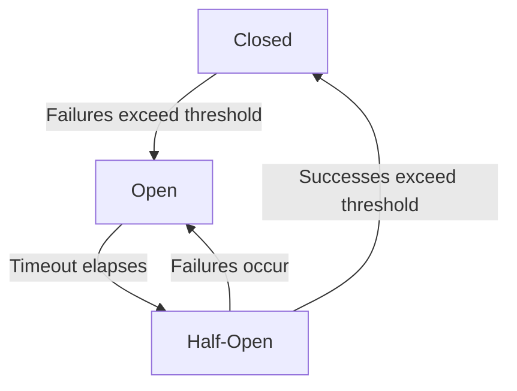

## Circuit Breaker
### Core Concepts

*   **Definition:** A design pattern used in distributed systems to prevent cascading failures. It wraps calls to external services (e.g., microservices, databases) and monitors for failures.
*   **Purpose:**
    *   Stops an application from repeatedly trying to invoke a service that is likely to fail.
    *   Allows the failing service time to recover without being overwhelmed by requests.
    *   Provides immediate feedback to the caller that the service is unavailable, avoiding long timeouts.
*   **States:**
    *   **Closed:** Normal operation. Requests are allowed to pass through to the protected service. Failures are monitored.
    *   **Open:** If failures (e.g., error rate, consecutive failures) exceed a predefined threshold, the circuit trips (opens). All subsequent requests are immediately rejected or fail fast without calling the protected service.
    *   **Half-Open:** After a configurable `timeout` period in the Open state, the circuit transitions to Half-Open. A limited number of test requests are allowed through to the protected service to check its health.
        *   If these test requests succeed, the circuit returns to Closed.
        *   If they fail, the circuit returns to Open for another timeout period.

### Key Details & Nuances

*   **Failure Detection:**
    *   **Error Rate:** Circuit opens if the percentage of failures (e.g., HTTP 5xx, network errors) within a rolling window exceeds a threshold. Requires a minimum number of requests to make the decision.
    *   **Consecutive Failures:** Circuit opens if a fixed number of consecutive failures occur. Simpler, but less robust to transient network blips.
    *   **Latency Threshold:** Circuit opens if average response time exceeds a defined limit, indicating potential service degradation.
*   **Configuration Parameters:**
    *   **Failure Threshold:** Number/percentage of failures to trip the circuit (e.g., 5 consecutive errors, 50% error rate over 100 requests).
    *   **Reset Timeout:** Duration the circuit stays in the Open state before transitioning to Half-Open (e.g., 30 seconds).
    *   **Success Threshold (Half-Open):** Number of successful requests in the Half-Open state required to close the circuit (e.g., 3 successful requests).
*   **Integration:** Can be implemented at various layers:
    *   **Client-Side Libraries:** (e.g., Hystrix in Java, Polly in .NET, internal libraries). Gives fine-grained control to each service.
    *   **Service Mesh:** (e.g., Istio, Linkerd) Circuit breaking can be configured and enforced transparently at the proxy level without modifying application code. Centralized management.
    *   **API Gateway:** Applies circuit breaking to incoming requests before routing to backend services, protecting the entire system from specific service overloads.
*   **Relationship with Other Patterns:**
    *   Often used with **Retries**: A circuit breaker prevents retries to a clearly failing service, while a retry mechanism handles transient errors when the circuit is Closed.
    *   Complements **Timeouts**: Timeouts prevent individual requests from hanging; circuit breakers prevent *many* requests from hanging by cutting off calls.
    *   Works well with **Bulkhead**: Limits resource consumption (e.g., thread pools) for specific dependencies, preventing a single failing dependency from exhausting resources for others.

### Practical Examples

**1. Basic Circuit Breaker State Transitions (Mermaid Diagram)**



**2. Simplified TypeScript Implementation Sketch**

```typescript
enum CircuitState {
    Closed,
    Open,
    HalfOpen,
}

class CircuitBreaker {
    private state: CircuitState = CircuitState.Closed;
    private failureCount: number = 0;
    private lastFailureTime: number = 0;
    private resetTimeoutMs: number; // Time in MS to stay open
    private failureThreshold: number; // Max failures before opening
    private halfOpenSuccessThreshold: number; // Successes in Half-Open to close

    constructor(
        failureThreshold: number = 5,
        resetTimeoutMs: number = 30000, // 30 seconds
        halfOpenSuccessThreshold: number = 2
    ) {
        this.failureThreshold = failureThreshold;
        this.resetTimeoutMs = resetTimeoutMs;
        this.halfOpenSuccessThreshold = halfOpenSuccessThreshold;
    }

    public async execute<T>(fn: () => Promise<T>): Promise<T> {
        if (this.state === CircuitState.Open) {
            if (Date.now() - this.lastFailureTime > this.resetTimeoutMs) {
                console.log("Circuit transitioning to Half-Open.");
                this.state = CircuitState.HalfOpen;
                this.failureCount = 0; // Reset for half-open test
            } else {
                console.log("Circuit is Open. Failing fast.");
                throw new Error("CircuitBreaker: Service is unavailable.");
            }
        }

        try {
            const result = await fn();
            this.onSuccess();
            return result;
        } catch (error) {
            this.onFailure();
            throw error; // Re-throw the original error
        }
    }

    private onSuccess(): void {
        if (this.state === CircuitState.Closed) {
            this.failureCount = 0; // Reset consecutive failures
        } else if (this.state === CircuitState.HalfOpen) {
            this.failureCount++; // Count successes in this context
            if (this.failureCount >= this.halfOpenSuccessThreshold) {
                console.log("Circuit transitioned to Closed (success).");
                this.state = CircuitState.Closed;
                this.failureCount = 0;
            }
        }
    }

    private onFailure(): void {
        if (this.state === CircuitState.Closed) {
            this.failureCount++;
            if (this.failureCount >= this.failureThreshold) {
                console.log("Circuit transitioned to Open (failure threshold met).");
                this.state = CircuitState.Open;
                this.lastFailureTime = Date.now();
                this.failureCount = 0; // Reset for next half-open check
            }
        } else if (this.state === CircuitState.HalfOpen) {
            console.log("Circuit transitioned back to Open (failure in Half-Open).");
            this.state = CircuitState.Open;
            this.lastFailureTime = Date.now();
            this.failureCount = 0;
        }
    }
}

// Example usage:
const myServiceCall = async () => {
    // Simulate a failing service for a few calls, then recover
    if (Math.random() < 0.8 && CircuitBreaker['callCount'] < 5) {
        CircuitBreaker['callCount'] = (CircuitBreaker['callCount'] || 0) + 1;
        console.log(`Call #${CircuitBreaker['callCount']} failed.`);
        throw new Error("Service error");
    }
    console.log("Service call successful!");
    return "Data";
};

const cb = new CircuitBreaker(3, 5000, 1); // 3 failures, 5s timeout, 1 success in Half-Open

async function testCircuitBreaker() {
    for (let i = 0; i < 10; i++) {
        try {
            const result = await cb.execute(myServiceCall);
            console.log(`Request ${i}: ${result}, State: ${CircuitState[cb['state']]}`);
        } catch (e: any) {
            console.error(`Request ${i}: ${e.message}, State: ${CircuitState[cb['state']]}`);
        }
        await new Promise(resolve => setTimeout(resolve, 1000)); // Wait 1 second
    }
}

// testCircuitBreaker();
```

### Common Pitfalls & Trade-offs

*   **Over-reliance:** Circuit breakers are a resilience pattern, not a fix for inherently broken services. They should complement, not replace, robust service design, scaling, and monitoring.
*   **Incorrect Parameter Tuning:**
    *   **Too sensitive:** Circuit opens too easily for minor transient issues, leading to unnecessary service unavailability.
    *   **Not sensitive enough:** Circuit takes too long to open, allowing cascading failures or extended user waits.
    *   **Reset timeout too short/long:** Service may not have enough time to recover, or users wait too long for recovery.
*   **Not Distinguishing Failure Types:** A circuit breaker might treat all errors (e.g., 400 Bad Request vs. 500 Internal Server Error) the same, leading to incorrect state transitions. It's often better to break on server-side errors (5xx) or network errors.
*   **Ignoring User Experience:** While circuit breakers protect the system, they lead to immediate failures for the user. Consider fallback mechanisms or graceful degradation alongside.
*   **Local vs. Distributed State:** Most implementations manage state locally per service instance. In a highly distributed system, this means different instances might have different views of a dependency's health. Centralized solutions (e.g., service mesh) offer a more consistent view but add complexity.
*   **Overhead:** There's a slight overhead in monitoring calls and managing state, though typically negligible compared to the benefits.

### Interview Questions

1.  **Explain the purpose of a Circuit Breaker pattern and its different states. Illustrate how it works with a practical scenario.**
    *   **Answer:** A Circuit Breaker prevents a system from repeatedly trying to access a failing service, thus averting cascading failures and giving the failing service time to recover. Its three states are:
        *   **Closed:** Normal operation, requests pass through. If failures exceed a threshold, it opens.
        *   **Open:** All requests are immediately rejected/fail-fast. After a reset timeout, it transitions to Half-Open.
        *   **Half-Open:** A limited number of test requests are allowed. If successful, it closes; if they fail, it re-opens.
        *   **Scenario:** An e-commerce backend calls an external payment gateway. If the gateway starts returning 500 errors consistently, the Circuit Breaker opens, causing payment requests to fail instantly within the e-commerce service rather than timing out and building up a backlog. After 30 seconds (Open state timeout), it sends one test request. If successful, it re-enables payments; if not, it remains open for another period.

2.  **How does a Circuit Breaker differ from a simple timeout or retry mechanism, and when would you use a Circuit Breaker in conjunction with them?**
    *   **Answer:**
        *   **Timeout:** Limits the duration an individual request waits for a response. It prevents a single request from hanging indefinitely.
        *   **Retry:** Attempts to re-execute a failed operation, usually for transient errors.
        *   **Circuit Breaker:** Goes beyond individual requests. It monitors the *overall health* of a dependency. If a dependency is clearly unhealthy, it stops *all* future requests to it for a period, failing fast without even trying.
        *   **Conjunction:** Use a timeout for every external call. Use retries for *transient* errors when the circuit is `Closed`. If the circuit is `Open`, do *not* retry, as it indicates a systemic issue, and retries would only exacerbate the problem for the already struggling service.

3.  **What parameters are critical to configure a Circuit Breaker effectively, and what are the trade-offs involved in tuning them?**
    *   **Answer:** Critical parameters include:
        *   **Failure Threshold:** (e.g., `5 consecutive errors`, `50% error rate over 100 requests`). Trade-off: Too low means false positives for minor glitches; too high means delayed protection and potential cascading failures.
        *   **Reset Timeout:** (e.g., `30 seconds`). Trade-off: Too short risks premature re-opening when the service hasn't fully recovered, leading to a "flapping" circuit. Too long prolongs unavailability even after the service has recovered.
        *   **Success Threshold (Half-Open):** (e.g., `2 successful requests`). Trade-off: Too low might close the circuit too easily on a lucky success; too high delays closing and keeps availability low.
    *   Tuning requires understanding the dependency's typical error rates, recovery times, and the system's tolerance for downtime vs. false positives.

4.  **In a microservices architecture, where would you typically implement Circuit Breakers (client-side, service mesh, API Gateway) and what are the advantages/disadvantages of each approach?**
    *   **Answer:**
        *   **Client-Side Libraries (e.g., within each microservice's code):**
            *   **Advantages:** Fine-grained control per service/dependency, no external dependency for implementation.
            *   **Disadvantages:** Requires developers to implement/configure in every service, inconsistencies across services, language-specific solutions.
        *   **Service Mesh (e.g., Istio, Linkerd):**
            *   **Advantages:** Centralized configuration and enforcement via sidecar proxies, transparent to application code, language-agnostic, consistent policy application.
            *   **Disadvantages:** Adds operational complexity, potential for increased latency due to proxy hops.
        *   **API Gateway:**
            *   **Advantages:** Protects the entire backend from external traffic spikes or specific service overloads, can provide a single point of failure-fast for certain routes.
            *   **Disadvantages:** Less granular control than client-side, doesn't protect internal service-to-service calls that bypass the gateway.
    *   **Preferred approach:** Service Mesh for internal microservice communication due to consistency and transparency. Client-side as a fallback or for specialized cases. API Gateway for external ingress traffic.