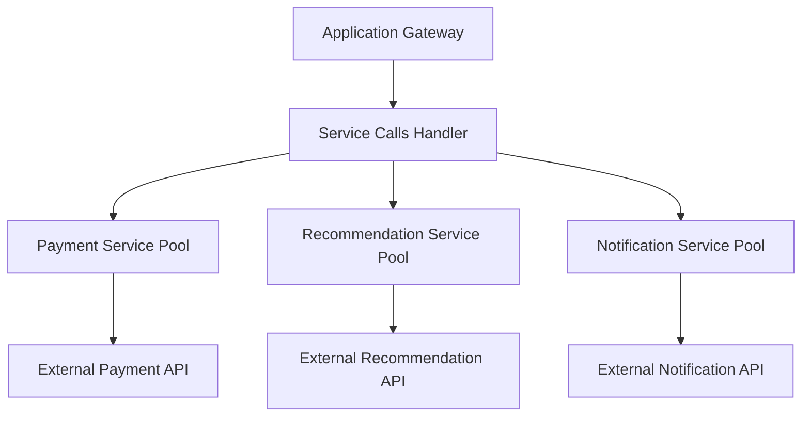

## Bulkhead Pattern
### Core Concepts
*   **Purpose:** A resilience pattern designed to isolate elements of a system into different pools of resources (e.g., threads, memory, connections) to prevent one failing part from consuming all available resources and causing the entire system to fail.
*   **Analogy:** Similar to the watertight compartments in a ship. If one compartment is breached, only that compartment fills with water, preventing the entire ship from sinking.
*   **Goal:** To contain failures and limit their blast radius, ensuring that critical functionalities remain available even when non-critical ones fail or become overloaded.

### Key Details & Nuances
*   **Resource Isolation:** Achieved by dedicating separate resource pools for different types of requests, services, or tenants.
    *   **Execution Bulkheads:** Separate thread pools for different service calls or types of operations. E.g., a pool for calls to Service A, another for Service B.
    *   **Connection Bulkheads:** Separate connection pools for different external services or databases.
    *   **Data Bulkheads:** Separating data storage for different tenants.
*   **Failure Containment:** If a particular service or dependency becomes slow or unavailable, only its dedicated resource pool gets exhausted or blocked, leaving other parts of the system unaffected.
*   **Complementary to Circuit Breaker:**
    *   **Bulkhead:** Prevents overload by resource limiting *before* a failure occurs, isolating potential issues. (Proactive)
    *   **Circuit Breaker:** Reacts to failures by quickly failing requests to a problematic service once a threshold is met. (Reactive)
    *   They are often used together for comprehensive resilience.

### Practical Examples

#### Conceptual Bulkhead Implementation (Execution Isolation)

```typescript
// Conceptual example demonstrating execution bulkhead for different external services
class ServiceProxy {
    private serviceAThreadPool: number = 5; // Max 5 concurrent calls to Service A
    private serviceBThreadPool: number = 10; // Max 10 concurrent calls to Service B
    private currentServiceAThreads: number = 0;
    private currentServiceBThreads: number = 0;

    async callServiceA(data: any): Promise<any> {
        if (this.currentServiceAThreads >= this.serviceAThreadPool) {
            throw new Error("Service A Bulkhead Exceeded: Too many concurrent calls.");
        }
        this.currentServiceAThreads++;
        try {
            // Simulate an async external service call
            console.log("Calling Service A...");
            await new Promise(resolve => setTimeout(resolve, Math.random() * 1000));
            return `Response from Service A with ${data}`;
        } finally {
            this.currentServiceAThreads--;
        }
    }

    async callServiceB(data: any): Promise<any> {
        if (this.currentServiceBThreads >= this.serviceBThreadPool) {
            throw new Error("Service B Bulkhead Exceeded: Too many concurrent calls.");
        }
        this.currentServiceBThreads++;
        try {
            // Simulate another async external service call
            console.log("Calling Service B...");
            await new Promise(resolve => setTimeout(resolve, Math.random() * 500));
            return `Response from Service B with ${data}`;
        } finally {
            this.currentServiceBThreads--;
        }
    }
}

// Usage example:
async function main() {
    const proxy = new ServiceProxy();

    // Calls to Service A will be limited by serviceAThreadPool
    for (let i = 0; i < 7; i++) {
        proxy.callServiceA(`request ${i}`).catch(err => console.error(err.message));
    }

    // Calls to Service B will be limited by serviceBThreadPool
    for (let i = 0; i < 12; i++) {
        proxy.callServiceB(`request ${i}`).catch(err => console.error(err.message));
    }
}

main();
```

#### Diagram: Bulkhead Pattern for External Service Calls



### Common Pitfalls & Trade-offs
*   **Resource Overhead:** Each bulkhead requires dedicated resources (threads, memory). Over-segmentation can lead to inefficient resource utilization and increased operational cost.
*   **Increased Complexity:** Managing multiple resource pools adds complexity to configuration, monitoring, and deployment.
*   **Granularity Challenge:** Determining the right level of isolation (e.g., per service, per API endpoint, per customer) is crucial and can be difficult. Too coarse, and failures spread; too fine, and overhead becomes prohibitive.
*   **Monitoring Burden:** Each isolated bulkhead needs independent monitoring to detect saturation or failure, requiring more sophisticated observability.
*   **Performance vs. Resilience:** A higher degree of isolation (more bulkheads) generally improves resilience but can introduce more context switching overhead or idle resources.

### Interview Questions

1.  **Question:** Explain the Bulkhead Pattern and provide a scenario where it would be critical for system stability.
    *   **Answer:** The Bulkhead Pattern isolates components into separate resource pools (e.g., thread pools, connection pools) to prevent a failure or overload in one component from cascading and affecting the entire system. It's critical in microservices architectures where one slow or failing service (e.g., a "Recommendation Service" dependency) could otherwise exhaust all available threads or connections, leading to the entire "Shopping Cart Service" becoming unresponsive, even for unrelated requests.

2.  **Question:** How does the Bulkhead Pattern differ from a Circuit Breaker, and when would you use them together?
    *   **Answer:** A Bulkhead Pattern is proactive, preventing resource exhaustion by segregating resources before a failure occurs. A Circuit Breaker is reactive, detecting failures and short-circuiting calls to a failing service after a threshold is met. They are complementary: a bulkhead prevents saturation and limits the blast radius, while a circuit breaker prevents continuous calls to an already failing service, allowing it time to recover and preserving client resources. Use them together for robust fault tolerance; bulkhead for resource isolation, circuit breaker for failure detection and rapid fallback.

3.  **Question:** What are the main trade-offs or challenges you'd consider when implementing the Bulkhead Pattern in a large-scale distributed system?
    *   **Answer:** Key trade-offs include increased resource consumption (each bulkhead reserves resources, potentially leading to idle resources), operational complexity in managing and monitoring many isolated pools, and the challenge of determining the optimal granularity for isolation (too many fine-grained bulkheads increase overhead; too few make them ineffective). There's also a balance between system performance and resilience.

4.  **Question:** Can the Bulkhead Pattern be applied to resources other than threads or connections? Provide an example.
    *   **Answer:** Yes, it can be applied to various resources. For example:
        *   **Queues:** Using separate message queues for different types of messages (e.g., critical orders vs. logging events) to prevent a backlog in one type from blocking processing of others.
        *   **Databases/Data Stores:** Using separate database instances or tablespaces for different tenants or critical vs. non-critical data, ensuring one tenant's heavy load doesn't impact others, or a critical data store remains available.
        *   **Compute Instances:** Running different microservices on separate compute instances or Kubernetes pods to isolate resource consumption and prevent noisy neighbor issues.

5.  **Question:** Imagine you have a backend service that calls three different external APIs: a critical payment API, a frequently used user profile API, and an optional analytics API. How would you apply the Bulkhead Pattern here?
    *   **Answer:** I would implement three distinct bulkheads, likely using separate thread pools or connection pools, one for each external API.
        *   **Payment API Bulkhead:** A small, highly prioritized pool. Even if it's slow, it should not starve other operations. If this pool is exhausted, only payment-related operations would fail, not the entire application.
        *   **User Profile API Bulkhead:** A medium-sized pool, as it's frequently used.
        *   **Analytics API Bulkhead:** A larger, lower-priority pool. If this API is slow or fails, it consumes resources only from its dedicated pool, ensuring that payment and user profile operations remain unaffected. This setup ensures that a problem with the optional analytics service doesn't impact critical functionalities.