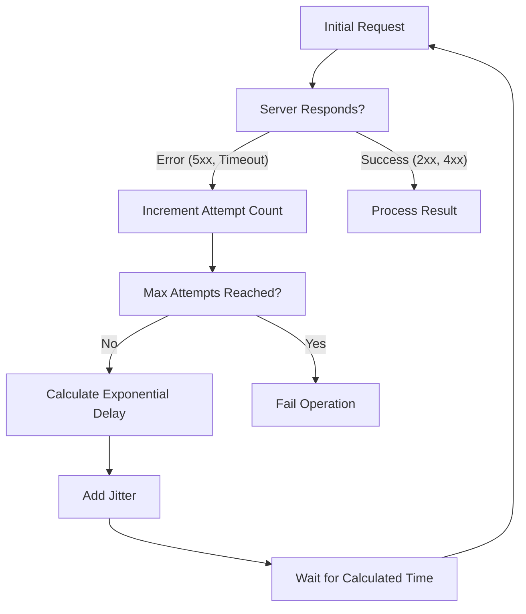

## Exponential Backoff & Jitter
### Core Concepts
*   **Exponential Backoff:** A strategy where a client progressively waits longer between successive retries for a failed operation. The wait time increases exponentially (e.g., `base * 2^retries`).
    *   **Purpose:** To prevent overwhelming a struggling server (or system component) with continuous retries, allowing it time to recover, and reducing the load on both client and server.
*   **Jitter:** The introduction of a small, random delay into the calculated backoff time.
    *   **Purpose:** To prevent the "thundering herd" problem, where multiple clients, after backing off, all retry simultaneously at the same exact time, leading to synchronized requests that can overwhelm the server again.

### Key Details & Nuances
*   **Formula:** `delay = min(max_delay, random_between(0, base * 2^retries))`
    *   `base`: Initial delay (e.g., 100ms).
    *   `retries`: Number of failed attempts.
    *   `max_delay`: Upper bound on the wait time to prevent excessively long delays.
    *   `min_delay`: Often implicitly `base` or `0` depending on jitter type.
*   **Jitter Types:**
    *   **Full Jitter:** `delay = random_between(0, base * 2^retries)`. Most common and effective. Fully randomizes the retry time within the exponential window.
    *   **Decorrelated Jitter:** `delay = random_between(min_delay, delay * 3)`. Aims to maintain randomness without hitting the same peak for each client, often making the average backoff time increase faster than pure exponential. Less common than full jitter for general purposes but can be useful in specific distributed scenarios.
*   **Max Attempts:** Crucial to define a maximum number of retries to prevent infinite loops and eventual failures, ensuring the client eventually gives up or escalates.
*   **Retry Conditions:** Typically applied to transient errors (e.g., network timeouts, HTTP 5xx errors, rate limits) but *not* to persistent errors (e.g., HTTP 4xx errors, invalid input).
*   **Idempotency:** Operations must be idempotent for safe retries (i.e., performing the operation multiple times has the same effect as performing it once). Non-idempotent operations (e.g., money transfers without transaction IDs) can lead to unintended side effects if retried.

### Practical Examples

#### TypeScript Implementation (Full Jitter)

```typescript
type RetryOptions = {
    maxAttempts?: number;
    baseDelayMs?: number; // Initial delay
    maxDelayMs?: number;  // Max overall delay
    jitterFactor?: number; // Multiplier for random range
};

async function withExponentialBackoffAndJitter<T>(
    operation: () => Promise<T>,
    options?: RetryOptions
): Promise<T> {
    const {
        maxAttempts = 5,
        baseDelayMs = 100,
        maxDelayMs = 10000, // 10 seconds
    } = options || {};

    let attempts = 0;
    while (attempts < maxAttempts) {
        try {
            return await operation();
        } catch (error: any) {
            attempts++;
            if (attempts >= maxAttempts) {
                console.error(`Operation failed after ${maxAttempts} attempts.`);
                throw error; // Re-throw if max attempts reached
            }

            // Calculate exponential backoff
            const rawDelay = baseDelayMs * Math.pow(2, attempts - 1); // 100, 200, 400, ...

            // Apply full jitter: random_between(0, rawDelay)
            const jitteredDelay = Math.random() * rawDelay;

            // Cap the delay at maxDelayMs
            const delayToUse = Math.min(jitteredDelay, maxDelayMs);

            console.warn(`Attempt ${attempts} failed. Retrying in ${delayToUse.toFixed(2)}ms...`);
            await new Promise(resolve => setTimeout(resolve, delayToUse));
        }
    }
    throw new Error("Should not reach here"); // In case maxAttempts is 0 or negative
}

// Example Usage:
async function unstableServiceCall() {
    console.log("Making service call...");
    if (Math.random() < 0.7) { // 70% chance of failure
        throw new Error("Service unavailable");
    }
    console.log("Service call successful!");
    return "Data";
}

// Run the example
(async () => {
    try {
        const result = await withExponentialBackoffAndJitter(unstableServiceCall, {
            maxAttempts: 4,
            baseDelayMs: 50,
            maxDelayMs: 2000
        });
        console.log("Final result:", result);
    } catch (e) {
        console.error("Operation ultimately failed.");
    }
})();
```

#### Flowchart for Retry Logic



### Common Pitfalls & Trade-offs
*   **Ignoring Max Attempts/Delay:** Without proper limits, clients can get stuck in infinite retry loops, consuming resources and never truly failing.
*   **Insufficient Jitter:** Leads to "thundering herd" when many clients retry at similar times, potentially causing cascading failures or a denial of service for the backend.
*   **Non-Idempotent Operations:** Retrying non-idempotent operations can lead to data corruption, duplicate transactions, or other undesirable side effects. Critical for state-changing operations.
*   **User Experience (UX):** Aggressive retries with long delays can degrade UX, leading to perceived slowness or unresponsiveness. Balance resilience with user patience.
*   **Resource Consumption:** Both on the client (open connections, memory for promises) and server (retry requests still hit the server) during prolonged retry sequences.
*   **Premature Optimisation:** Not every transient error needs the most sophisticated backoff. Simple fixed retries might suffice for very low-stakes operations.

### Interview Questions
1.  **When would you apply exponential backoff and jitter in a system design, and what problems do they solve?**
    *   **Answer:** They are crucial for improving system resilience and fault tolerance, particularly in distributed systems. Apply them when client services interact with external dependencies (databases, microservices, APIs) that might experience temporary unreachability, rate limiting, or transient errors (e.g., 5xx HTTP codes, network timeouts). They solve the "thundering herd" problem (jitter) and prevent clients from overwhelming struggling services with continuous retries (exponential backoff), allowing systems to recover gracefully.
2.  **Differentiate between "full jitter" and "decorrelated jitter." When might you prefer one over the other?**
    *   **Answer:** Both add randomness to exponential backoff. **Full jitter** randomly picks a delay within the entire `[0, base * 2^retries]` window. It's generally preferred for its simplicity and effectiveness in spreading out retries. **Decorrelated jitter** uses `random_between(min_delay, previous_delay * 3)`, making each subsequent delay independent of `base * 2^retries` and generally increasing faster. Decorrelated jitter can be useful in scenarios where you want to ensure a very broad spread of retry times, potentially reducing the chance of repeated collisions even when many clients are in sync, but it's more complex and can lead to longer overall retry times. Full jitter is the common default due to its balance of simplicity and effectiveness.
3.  **What are the consequences of *not* using jitter with exponential backoff, especially in a system with many clients hitting a shared resource?**
    *   **Answer:** Without jitter, all clients encountering an error at roughly the same time will calculate the *exact same* exponential backoff duration. When this duration expires, they will all retry simultaneously, leading to a "thundering herd" or "retry storm." This synchronized retry wave can repeatedly overwhelm the shared resource, preventing it from recovering and potentially causing a cascading failure throughout the system. Jitter breaks this synchronization by introducing randomness.
4.  **Discuss the importance of idempotency when implementing a retry mechanism with backoff and jitter. Provide an example.**
    *   **Answer:** Idempotency is paramount. If an operation is not idempotent, retrying it can lead to unintended and potentially harmful side effects, such as duplicate data, multiple charges for a single transaction, or incorrect state changes. For instance, if a `POST /create_order` endpoint is not idempotent and fails *after* processing but *before* sending a success response, a retry could create a second, duplicate order. An idempotent `POST` might include a unique client-generated request ID, allowing the server to recognize and ignore duplicate requests for the same ID.
5.  **How would you balance the effectiveness of aggressive retries (quick backoff, many attempts) with the impact on user experience and system load in a user-facing application?**
    *   **Answer:** This is a key trade-off. Aggressive retries can make the system more resilient but may lead to higher latency for the user (if waiting for retries), increased client-side resource consumption, and persistent load on a struggling backend.
    *   **Balance:**
        *   **Max Attempts & Max Delay:** Set reasonable limits. If the service is genuinely down, prolonged retries are futile.
        *   **User Feedback:** Provide immediate feedback to the user (e.g., "loading...", "retrying...", "network error"). Don't let the UI hang silently.
        *   **Error Escalation:** After a few quick retries, consider escalating to a larger backoff (e.g., minutes) or moving to an offline mode/queue, rather than continuous active retries.
        *   **Circuit Breaker:** Implement a circuit breaker pattern *before* the retry logic. If the service is consistently failing, the circuit breaker can fast-fail requests, preventing retries from even starting, thus reducing load and improving user experience by failing faster.
        *   **Graceful Degradation:** For non-critical operations, consider degrading gracefully instead of constant retries (e.g., displaying cached data or partial content).