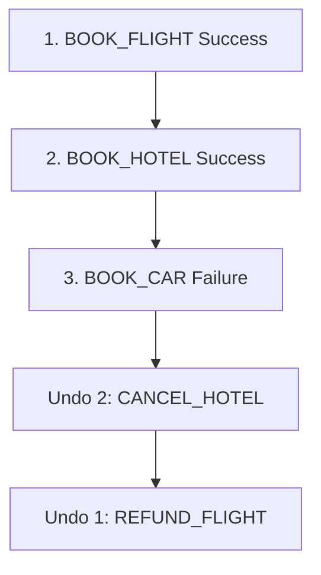

## Compensating Transaction
### Core Concepts

*   **Compensating Transaction:** A sequence of operations designed to undo a prior operation that has already been committed. Used to maintain data consistency in distributed systems when a series of operations (a business transaction) fails partway through.
*   **Purpose:** To roll back already completed but problematic steps within a larger, multi-step business process, ensuring atomicity (all-or-nothing) in practice for distributed transactions.
*   **Contrast with ACID Transactions:** Traditional ACID (Atomicity, Consistency, Isolation, Durability) transactions achieve rollback via a single, atomic unit. Compensating transactions are an application-level strategy for distributed systems where true distributed ACID is impractical or too costly.

### Key Details & Nuances

*   **Idempotency:** Compensating operations should ideally be idempotent. Executing a compensating transaction multiple times should have the same effect as executing it once. This is crucial because network issues or retries might lead to duplicate calls.
*   **Order of Compensation:** Compensating transactions must be executed in the reverse order of the original operations they are undoing.
*   **State Management:** The system must reliably track the state of each original operation (completed, failed, compensating) to know which compensating transactions to execute.
*   **Failure of Compensation:** If a compensating transaction itself fails, the system enters a difficult state (partially rolled back). Strategies to handle this include:
    *   Manual intervention/alerting.
    *   Retrying the compensating transaction.
    *   Designing compensating transactions that are robust to failure or can be marked as "already compensated."
*   **Saga Pattern:** Compensating transactions are a core component of the Saga pattern, which manages long-running, distributed business transactions.
    *   **Choreography:** Each service publishes events that trigger subsequent services, and also triggers compensating actions on preceding services if it fails.
    *   **Orchestration:** A central orchestrator manages the sequence of operations and compensating actions.
*   **Eventual Consistency:** Systems using compensating transactions typically achieve eventual consistency rather than strong consistency.

### Practical Examples

Consider a travel booking system where a user books a flight, hotel, and car rental.

1.  **Flight Booking:** `BOOK_FLIGHT` (e.g., Charge credit card, reserve seat)
2.  **Hotel Booking:** `BOOK_HOTEL` (e.g., Reserve room)
3.  **Car Rental:** `BOOK_CAR` (e.g., Reserve car)

If `BOOK_CAR` fails after `BOOK_FLIGHT` and `BOOK_HOTEL` have succeeded:

*   **Original Operations:**
    *   `BOOK_FLIGHT` succeeds.
    *   `BOOK_HOTEL` succeeds.
    *   `BOOK_CAR` fails.
*   **Compensating Transactions (executed in reverse order of success):**
    *   **Undo `BOOK_HOTEL`:** `CANCEL_HOTEL` (e.g., Release room, refund credit card if already charged)
    *   **Undo `BOOK_FLIGHT`:** `REFUND_FLIGHT` (e.g., Refund credit card, release seat)

### Common Pitfalls & Trade-offs

*   **Complexity:** Implementing reliable compensating transactions and state management is complex.
*   **Data Inconsistency Window:** Between the original operation and its compensating action, the system might be in an inconsistent state. For example, a flight is booked, but the hotel is not yet cancelled.
*   **"Partial Failure" Visibility:** Users might see partial confirmations before compensation fully completes, leading to confusion if not handled carefully with UI feedback.
*   **Idempotency Implementation:** Ensuring idempotency for compensating actions can be tricky, especially if they involve external systems or external state changes.
*   **Rollback Failure:** The most significant pitfall. If a compensating transaction fails, manual intervention is often required, making the system less resilient.

### Interview Questions

1.  **Q: How would you handle a distributed transaction that spans multiple services, where one of the operations needs to be rolled back?**
    **A:** I would employ the Saga pattern. Each service would perform its local transaction and then publish an event. If a subsequent service fails, it would trigger compensating events for the preceding services. These compensating events would execute their respective "undo" operations in reverse order of the original successful operations to restore system consistency.

2.  **Q: What are the challenges with implementing compensating transactions, and how can they be mitigated?**
    **A:** Challenges include ensuring idempotency of compensating actions, managing the state of the overall transaction, and handling failures *within* the compensating actions themselves. Mitigation involves careful design for idempotency (e.g., using unique idempotency keys), robust state tracking (e.g., using a state machine or event sourcing), and designing compensating actions to be as robust as possible, potentially with retry mechanisms or manual recovery procedures.

3.  **Q: Explain the difference between a traditional ACID rollback and a compensating transaction.**
    **A:** ACID rollback is a built-in database mechanism for a single, atomic transaction, ensuring either all operations succeed or none do. Compensating transactions are an application-level strategy for distributed systems. They are a series of independent operations designed to undo previously committed actions when a larger business process fails partway, aiming for eventual consistency rather than immediate atomicity across services.

4.  **Q: What makes a compensating transaction "good" or "reliable"?**
    **A:** A reliable compensating transaction is **idempotent**, meaning it can be executed multiple times with the same outcome. It also needs to be **deterministic** and have minimal side effects on its own. Crucially, the system must have a robust mechanism to track which compensating actions are needed and in what order, and a strategy for dealing with the failure of the compensating action itself, often involving alerting for manual intervention or advanced retry logic.