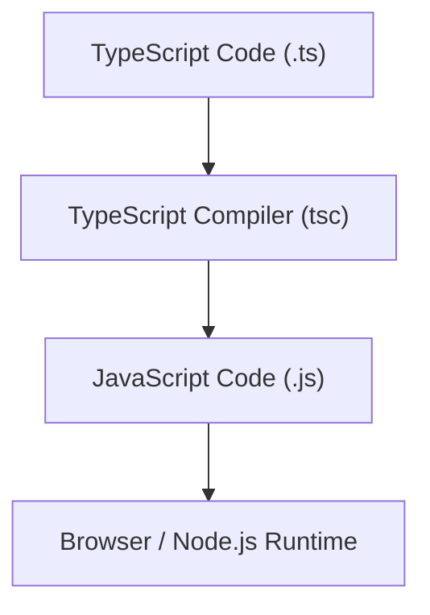

## TypeScript vs. JavaScript: The 'Why'
### Core Concepts
*   **JavaScript (JS):** A dynamically typed, interpreted programming language. Code runs directly. Types are checked at runtime.
*   **TypeScript (TS):** A superset of JavaScript that compiles to plain JavaScript. It adds static typing, allowing types to be checked at compile time.

### Key Details & Nuances
The "Why" of TypeScript primarily revolves around **developer experience, code quality, and scalability** for larger applications.

*   **Early Error Detection:**
    *   **JS:** Errors related to incorrect data types (e.g., trying to call a method on `undefined`) are only caught at runtime, often leading to production bugs.
    *   **TS:** The compiler catches these type-related errors *before* the code runs, significantly reducing runtime bugs and improving reliability.
        *   *Example:* Accessing a property that doesn't exist on an object.
*   **Enhanced Developer Experience (DX):**
    *   **IntelliSense & Autocompletion:** IDEs (like VS Code) leverage type information to provide powerful, accurate autocompletion, parameter hints, and code navigation. This makes development faster and less error-prone.
    *   **Refactoring Safety:** With type definitions, renaming variables or properties, or changing function signatures, becomes much safer. The compiler immediately flags all places where the change impacts existing code.
    *   **Self-Documenting Code:** Types serve as built-in documentation, making it easier for new team members (or your future self) to understand the expected shape of data and function inputs/outputs without relying solely on comments or external docs.
*   **Improved Code Quality & Maintainability:**
    *   **Clearer Contracts:** Types define clear interfaces for data structures and functions, fostering better API design within a codebase.
    *   **Reduced Ambiguity:** Explicit types remove ambiguity about the expected types of variables, arguments, and return values.
    *   **Scalability for Large Codebases:** As projects grow in size and complexity, maintaining consistency and preventing unexpected interactions between different parts of the code becomes challenging in pure JS. TypeScript's static analysis provides a crucial safety net.
*   **Modern JavaScript Features:** TypeScript often supports proposed ECMAScript features (e.g., decorators, optional chaining, nullish coalescing) before they are widely adopted in all JavaScript runtimes, providing a consistent way to use modern syntax and transpile it down to compatible JS.

### Practical Examples

**JavaScript (Potential Runtime Error):**

```javascript
// user.js
function greetUser(user) {
    // If 'user' is null or undefined, or just a string, this will throw a runtime error.
    console.log(`Hello, ${user.name.toUpperCase()}!`);
}

greetUser({ name: "Alice" }); // Works fine
greetUser("Bob");            // RUNTIME ERROR: Cannot read properties of undefined (reading 'toUpperCase')
greetUser(null);             // RUNTIME ERROR: Cannot read properties of null (reading 'name')
```

**TypeScript (Compile-Time Error Prevention):**

```typescript
// user.ts
interface User {
    name: string;
}

function greetUser(user: User) {
    // TypeScript ensures 'user' is of type User, so 'user.name' is guaranteed to exist and be a string.
    console.log(`Hello, ${user.name.toUpperCase()}!`);
}

greetUser({ name: "Alice" }); // OK

// TS2345: Argument of type 'string' is not assignable to parameter of type 'User'.
// This error is caught by the compiler BEFORE you run the code.
// greetUser("Bob");

// TS2345: Argument of type 'null' is not assignable to parameter of type 'User'.
// greetUser(null);
```

**TypeScript Compilation Process:**



### Common Pitfalls & Trade-offs
*   **Initial Learning Curve:** Developers new to static typing may find the initial overhead of defining types and understanding compiler errors challenging.
*   **Build Step Overhead:** TypeScript adds a compilation step to the development workflow, which can slightly increase build times, especially in very large projects.
*   **Configuration Complexity:** The `tsconfig.json` file can be complex to configure correctly, especially for specific project setups (e.g., integrating with testing frameworks, different module systems).
*   **Over-engineering Types:** It's possible to create overly complex or restrictive types that hinder flexibility or lead to unnecessary boilerplate. Finding the right balance is key.
*   **`any` Type Misuse:** Using `any` type too liberally bypasses TypeScript's type checking, defeating its primary purpose. It should be used sparingly, primarily for untyped third-party libraries or when type information is genuinely unavailable.
*   **Types are Erased:** TypeScript types are purely for compile-time checking. They are *removed* (erased) during compilation to JavaScript. This means type information is not available at runtime, which can sometimes surprise developers expecting runtime type reflection.

### Interview Questions

1.  **"Why would you choose TypeScript over JavaScript for a new mid-to-large-scale project?"**
    *   **Answer:** I'd choose TypeScript for its ability to catch type-related errors at compile-time, significantly reducing runtime bugs and increasing code reliability. For mid-to-large projects, TypeScript's static typing enhances developer experience through superior IntelliSense and safer refactoring, improves code maintainability with self-documenting types, and provides a crucial safety net for team collaboration and code scalability. The initial setup and learning curve are outweighed by the long-term benefits in code quality and development efficiency.

2.  **"Describe a scenario where TypeScript's type checking saved you from a significant bug."**
    *   **Answer:** In a recent project, we had a data transformation function that consumed an API response and mapped it to a UI model. Initially, in pure JavaScript, a specific API field (`userId` vs. `id`) was inconsistently named across different endpoints. A change in one API endpoint's response structure, where a field name changed from `emailAddress` to `userEmail`, would have caused a silent `undefined` error in the UI. TypeScript, by requiring the input object to conform to a specific interface (`interface UserAPI { userEmail: string; }`), immediately flagged the `emailAddress` access as a compile-time error, preventing a production bug and guiding me to update the mapping correctly.

3.  **"What are the main trade-offs of adopting TypeScript, and how would you address them?"**
    *   **Answer:** The primary trade-offs are an initial learning curve for developers new to static typing, the overhead of a compilation step, and potential complexity in `tsconfig.json` configuration. I'd address these by:
        1.  **Learning Curve:** Providing internal documentation, code examples, and pair programming sessions. Starting with simpler types and gradually introducing advanced features.
        2.  **Build Overhead:** Optimizing the build process with incremental builds, caching, and utilizing tools like `esbuild` or `SWC` for faster transpilation where appropriate.
        3.  **Configuration:** Using battle-tested base `tsconfig.json` files (e.g., from `@tsconfig/node16`) and keeping it as minimal as possible, only adding necessary overrides. For complex cases, thorough documentation of the configuration is key.

4.  **"Explain the difference between compile-time and runtime errors in the context of TypeScript and JavaScript."**
    *   **Answer:** In **JavaScript**, most errors are runtime errors, meaning they occur when the code is actually executing. For example, trying to access a property on an `undefined` variable will throw a `TypeError` *at the moment that line of code runs*. In **TypeScript**, the compiler performs static analysis *before* the code runs. It catches type-related errors (e.g., passing a number to a function expecting a string, or accessing a non-existent property) during the compilation step. These are *compile-time errors*. If TypeScript compiles successfully, it then produces plain JavaScript, which then runs and can still encounter JavaScript's inherent runtime errors (e.g., network issues, division by zero, logic errors not related to types).

5.  **"How does TypeScript actually run in a browser or Node.js environment?"**
    *   **Answer:** TypeScript code cannot run directly in browsers or Node.js because these environments only understand JavaScript. To execute TypeScript, it must first be *transpiled* (compiled) into plain JavaScript using the TypeScript compiler (`tsc`). This process involves checking types, resolving modules, and then stripping away all type annotations, leaving only valid JavaScript. The resulting JavaScript files are then what is actually run by the browser's JavaScript engine or Node.js runtime.