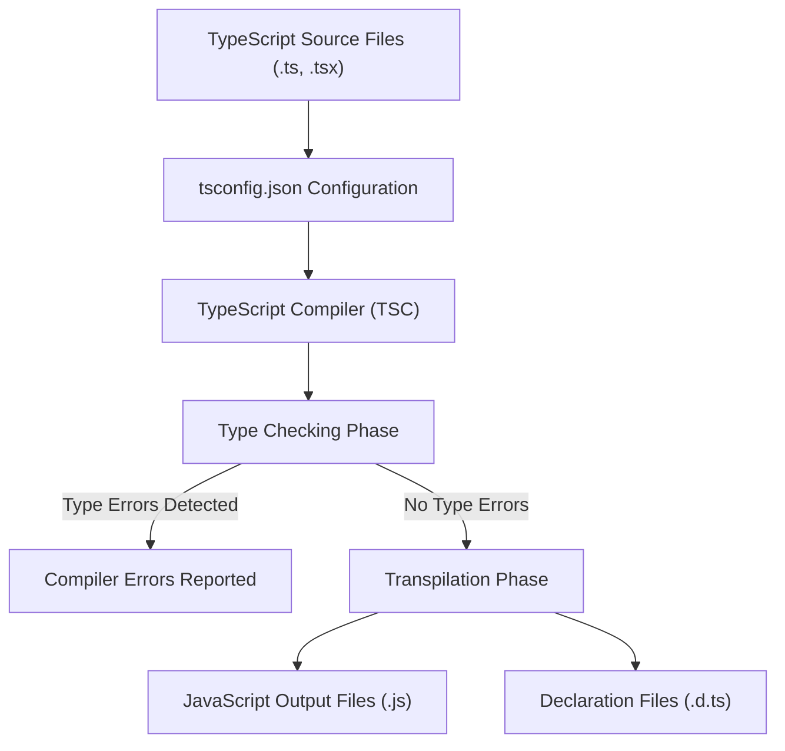

## The TypeScript Compiler (TSC) and `tsconfig.json`
### Core Concepts

*   **TypeScript Compiler (TSC):**
    *   A command-line tool (`tsc`) that compiles TypeScript code (`.ts`, `.tsx`, `.d.ts`) into plain JavaScript (`.js`) code.
    *   Performs static type checking during compilation, catching errors before runtime.
    *   Does not execute code; solely responsible for transpilation and type validation.
*   **`tsconfig.json`:**
    *   A configuration file that defines the root files and compiler options for a TypeScript project.
    *   When `tsc` is run without input files, it looks for `tsconfig.json` in the current directory or parent directories.
    *   Essential for defining how your TypeScript project is built, including target JavaScript version, module system, strictness rules, and output directory.

### Key Details & Nuances

*   **Compiler Options Categories:**
    *   **Project Files:** `files`, `include`, `exclude` specify which files TSC should process. `include` supports glob patterns. `exclude` is for ignoring specific files (e.g., `node_modules`).
    *   **Output:** `target` (ECMAScript version for output JS), `module` (module system for output JS, e.g., CommonJS, ESNext), `outDir` (output directory), `rootDir` (root directory of source files).
    *   **Type Checking:** `strict` (enables all strict type-checking options), `noImplicitAny`, `strictNullChecks`, `noUnusedLocals`, `noUnusedParameters`, `forceConsistentCasingInFileNames`.
    *   **Module Resolution:** `baseUrl`, `paths` (for alias paths), `esModuleInterop` (enables synthetic default imports for CommonJS/AMD modules).
    *   **JSX:** `jsx` (JSX emit mode, e.g., `react`, `react-jsx`).
    *   **Declaration Files:** `declaration` (generates `.d.ts` files for compiled JS).
*   **`extends` Property:** Allows one `tsconfig.json` file to inherit configurations from another, promoting reusability and consistency across sub-projects (e.g., `extends: "../tsconfig.base.json"`).
*   **Incremental Compilation & `--watch`:**
    *   `tsc --watch` keeps the compiler running and recompiles files on changes, significantly speeding up development feedback cycles.
    *   TSC uses a file system watcher to detect changes and only recompiles affected files.
*   **Project References (`references`):**
    *   A feature for monorepos or large projects to define dependencies between TypeScript projects.
    *   Enables faster incremental builds by only compiling changed dependent projects.
    *   Improves editor performance (Go to Definition, Find All References) across project boundaries.
*   **`skipLibCheck`:** Speeds up compilation by skipping type checking of declaration files (`.d.ts`), especially useful for `node_modules` where type correctness is usually assumed.

### Practical Examples

**Sample `tsconfig.json`:**

```json
{
  "compilerOptions": {
    "target": "es2020",                /* Specify ECMAScript target version for compiled JavaScript. */
    "module": "commonjs",             /* Specify module code generation (e.g., 'commonjs', 'esnext'). */
    "outDir": "./dist",               /* Redirect output structure to the directory. */
    "rootDir": "./src",               /* Specify the root directory of input files. */
    "strict": true,                   /* Enable all strict type-checking options. */
    "esModuleInterop": true,          /* Enables emit interoperability between CommonJS and ES Modules. */
    "skipLibCheck": true,             /* Skip type checking of all declaration files (*.d.ts). */
    "forceConsistentCasingInFileNames": true, /* Disallow inconsistently-cased references to the same file. */
    "jsx": "react",                   /* Support JSX in .tsx files. */
    "declaration": true,              /* Generate .d.ts files for every TypeScript or JavaScript file. */
    "sourceMap": true,                /* Emit source map files for debugging. */
    "baseUrl": "./",                  /* Base directory to resolve non-relative module names. */
    "paths": {                        /* A series of entries which re-map imports to lookup locations. */
      "@utils/*": ["src/utils/*"],
      "@models/*": ["src/models/*"]
    }
  },
  "include": [
    "src/**/*",                       /* Include all .ts, .tsx, .d.ts files in src directory. */
    "types/**/*.d.ts"                 /* Include custom declaration files. */
  ],
  "exclude": [
    "node_modules",                   /* Exclude node_modules from compilation. */
    "**/*.spec.ts"                    /* Exclude test files. */
  ],
  "references": [                     /* Project references for monorepo setups. */
    { "path": "../common" }
  ]
}
```

**TypeScript Compilation Process:**



### Common Pitfalls & Trade-offs

*   **Incorrect `include`/`exclude`:** Can lead to files not being compiled or unnecessary files being included, slowing down compilation or introducing unexpected build artifacts.
*   **Misunderstanding `module` vs. `target`:**
    *   `target` affects the *syntax* of the emitted JavaScript (e.g., `es5` for `var`/`function`, `es2020` for `let`/`const`/`async`/`await`).
    *   `module` affects the *module system* of the emitted JavaScript (e.g., `commonjs` for `require`/`module.exports`, `esnext` for `import`/`export`).
    *   Often, `target` is set to an older version for broader browser compatibility, while `module` is set to `esnext` or `commonjs` depending on the runtime environment (browser vs. Node.js).
*   **Over-reliance on `any` or `noImplicitAny: false`:** While pragmatic for quick prototyping, it defeats the purpose of TypeScript's type safety and leads to runtime errors that TypeScript was designed to prevent. Trade-off: faster initial development vs. long-term maintainability and bug prevention.
*   **Large Monolithic `tsconfig.json` in Monorepos:** Without `references`, builds can become very slow as every change triggers a full recompilation of the entire monorepo. Trade-off: setup complexity for significant build performance gains.
*   **Forgetting `outDir`:** If not specified, compiled JavaScript files will be placed alongside your TypeScript source files, cluttering the source directory.

### Interview Questions

1.  **What is the primary role of `tsconfig.json` in a TypeScript project, and why is it crucial?**
    *   **Answer:** `tsconfig.json` defines the root files and compiler options for a TypeScript project. It's crucial because it dictates *how* the TypeScript Compiler (TSC) should transform your TypeScript code into JavaScript, including the target JavaScript version (`target`), module system (`module`), strictness rules (`strict`), where to output compiled files (`outDir`), and which files to include or exclude. Without it, `tsc` would either default to very basic options or require complex command-line arguments, making project management unscalable and inconsistent.

2.  **Explain the difference between the `target` and `module` compiler options in `tsconfig.json`. When would you choose different values for them?**
    *   **Answer:** `target` determines the ECMAScript version of the *syntactic features* the compiled JavaScript will use (e.g., `es5` for `var` and function-based classes, `es2020` for `async/await`, `BigInt`, etc.). `module` determines the *module system* of the compiled JavaScript (e.g., `commonjs` for Node.js `require`/`module.exports`, `esnext` for modern `import`/`export` syntax). You might choose `target: "es5"` for maximum browser compatibility while setting `module: "esnext"` (or `commonjs`) to leverage modern module bundling or Node.js environments, allowing bundlers to handle the module resolution.

3.  **How does TSC typically handle `node_modules` when compiling, and what is the purpose of `skipLibCheck`?**
    *   **Answer:** By default, TSC type-checks all `.d.ts` (declaration) files within `node_modules` to ensure type compatibility with your project's code. This can be time-consuming, especially for large projects with many dependencies. `skipLibCheck: true` is an option that tells TSC to skip type-checking of all declaration files. Its purpose is to significantly speed up compilation times, as it assumes that the type definitions provided by libraries in `node_modules` are already correct and stable, reducing redundant checks.

4.  **Describe the benefits of using Project References (`references`) in `tsconfig.json`, especially in the context of a monorepo.**
    *   **Answer:** Project References allow you to define dependencies between different TypeScript projects within a larger codebase, particularly beneficial in monorepos. The key benefits are:
        1.  **Faster Incremental Builds:** Only changed projects and their direct dependents are recompiled, avoiding full-project recompilations.
        2.  **Improved IDE Performance:** Editor features like "Go to Definition" or "Find All References" work correctly and efficiently across project boundaries.
        3.  **Better Code Organization:** Encourages breaking down large applications into smaller, more manageable, and independently compilable units.
        4.  **Enforced Boundaries:** Helps ensure that projects only depend on what they declare, reducing accidental cross-project dependencies.