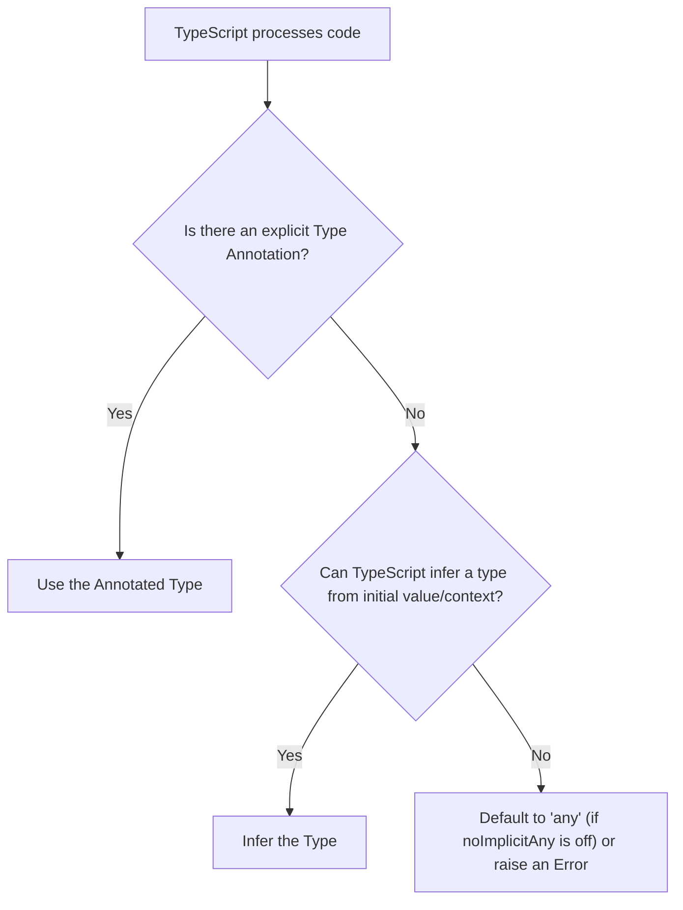

## Type Inference vs. Type Annotation
### Core Concepts

*   **Type Inference:** TypeScript's ability to automatically determine the type of a variable, function return value, or expression based on its initial value or usage, without explicit type declarations.
    *   **Goal:** Reduce boilerplate, keep code concise while maintaining type safety.
    *   **When it occurs:** During variable initialization, property assignments, function return statements, and array/object literal definitions.
*   **Type Annotation:** Explicitly declaring the type of a variable, parameter, or function return value using the `: Type` syntax.
    *   **Goal:** Provide clear documentation, ensure precise type safety, and guide the compiler where inference is ambiguous or insufficient.

### Key Details & Nuances

*   **Compiler-Time Only:** Both inference and annotation are compile-time constructs. They have no runtime impact on the JavaScript output.
*   **Prioritization:** Annotation always takes precedence over inference. If a type is explicitly annotated, TypeScript will use that type.
*   **Necessity of Annotation:**
    *   **Function Parameters:** Always require explicit annotation because there's no initial value for inference.
    *   **Variables Without Initializers:** `let x: number;`
    *   **Empty Arrays:** `let arr: string[] = [];` (otherwise `any[]` or `never[]` depending on `strictNullChecks`).
    *   **Complex or Ambiguous Types:** When the type isn't immediately clear from initialization, or to enforce a stricter type than inferred.
    *   **Function Return Types:** Good practice for public APIs or complex functions to ensure stability and clarity, even if inference might correctly deduce it.
*   **Contextual Typing:** A powerful form of type inference where the type of an expression is determined by its "location" or the context in which it's used. This often applies to function expressions (callbacks).

### Practical Examples

```typescript
// --- Type Inference Examples ---

// Primitives: Types inferred from literal values
let inferredString = "Hello, TypeScript"; // Type: string
let inferredNumber = 123;             // Type: number
const inferredBoolean = true;         // Type: true (literal type, due to `const`)

// Arrays: Inferred from array literal elements
let inferredNumbers = [1, 2, 3];      // Type: number[]
let inferredMixed = [1, "two"];       // Type: (string | number)[]

// Objects: Inferred from property types
let inferredObject = { name: "Alice", age: 30 }; // Type: { name: string; age: number; }

// Function Return Type: Inferred from return statement
function add(a: number, b: number) {
    return a + b; // Inferred return type: number
}

// --- Type Annotation Examples ---

// Primitives with explicit type
let annotatedString: string = "Hello, TypeScript";
let annotatedNumber: number; // Annotation needed if no initializer
annotatedNumber = 456;

// Function Parameters & Return Type: Always annotate parameters; good practice for return
function subtract(a: number, b: number): number {
    return a - b;
}

// Empty Array: Annotation is crucial to prevent `any[]` or `never[]`
let annotatedStrings: string[] = [];
annotatedStrings.push("abc");

// Object with Interface: Annotation against a defined structure
interface User {
    id: number;
    name: string;
}
const newUser: User = { id: 1, name: "Bob" };

// --- Contextual Typing Example ---
// The type of 'event' is inferred from the 'EventListener' type
type EventListener = (event: MouseEvent) => void;

const handleButtonClick: EventListener = (event) => {
    // 'event' is contextually typed as MouseEvent,
    // so 'event.clientX' is type-safe without explicit annotation on 'event'
    console.log(event.clientX);
};
```

#### TypeScript Type Determination Flow



### Common Pitfalls & Trade-offs

*   **Over-annotation (Redundancy):** Explicitly annotating types where inference is perfectly clear (e.g., `let x: number = 5;`). This adds visual noise without much benefit, reducing conciseness.
*   **Under-annotation (Implicit `any`):** Failing to annotate where inference is insufficient or results in `any` (e.g., `let data = [];` without `string[]`), leading to a loss of type safety. The `noImplicitAny` compiler option helps prevent this.
*   **Readability vs. Conciseness:** Inference keeps simple code clean and concise. Annotation enhances clarity for complex types, function signatures, or public APIs, but can make simple code more verbose. Striking the right balance is key.
*   **Maintainability:** While inference can make initial code quicker to write, explicit annotations (especially for function signatures and data structures) can significantly improve long-term maintainability, acting as self-documentation and preventing accidental breaking changes.

### Interview Questions

1.  **Q:** What is the fundamental difference between Type Inference and Type Annotation in TypeScript? Provide scenarios where you would prioritize one over the other.
    **A:** Type Inference is TypeScript's automatic type deduction, whereas Type Annotation is explicit type declaration. I'd prioritize **inference** for simple, clearly typed variables (`let count = 0;`) and when return types are obvious. I'd use **annotation** for function parameters (always required), function return types (for clarity and API stability), uninitialized variables (`let data: string[];`), and for empty arrays (`const names: string[] = [];`) to avoid `any[]`.

2.  **Q:** Discuss the trade-offs involved in choosing between relying heavily on type inference versus consistently using explicit type annotations in a large TypeScript codebase.
    **A:** Relying heavily on inference leads to more concise code, reducing boilerplate, which is great for readability in simple cases. However, it can obscure the true intent of complex types or lead to implicit `any` issues if `noImplicitAny` is off. Consistent annotation provides explicit documentation, enhances clarity for complex types, and improves long-term maintainability by making contracts clear. The trade-off is verbosity, especially for simple types. A balanced approach leverages inference where types are obvious and uses annotation where clarity, safety, or API stability is paramount.

3.  **Q:** Explain "contextual typing" in TypeScript and how it relates to type inference. Give an example.
    **A:** Contextual typing is a specialized form of type inference where the type of an expression is derived from its "context" or the location where it's used. Instead of inferring from the value itself, TypeScript looks at the expected type from the surrounding code. This is very common with callback functions.
    *Example:*
    ```typescript
    type Validator = (value: string) => boolean;
    const isEmail: Validator = (input) => {
        // 'input' is contextually typed as 'string' from 'Validator'
        return input.includes('@');
    };
    ```
    Here, `input` doesn't need an explicit annotation because its type is inferred from the `Validator` type assignment.

4.  **Q:** How do compiler options like `noImplicitAny` and `strictNullChecks` influence your decision-making regarding type inference and annotation?
    **A:** Both options force more explicit type handling. `noImplicitAny: true` prevents TypeScript from inferring `any` for variables or parameters that could not be fully inferred. This *forces* me to provide an explicit annotation where `any` would otherwise be silently used, significantly increasing type safety. `strictNullChecks: true` means `null` and `undefined` are not assignable to types unless explicitly included (e.g., `string | null`). This encourages more precise type annotations or union types, preventing common runtime errors related to null/undefined values. Together, they push towards a more explicit and robust type system.