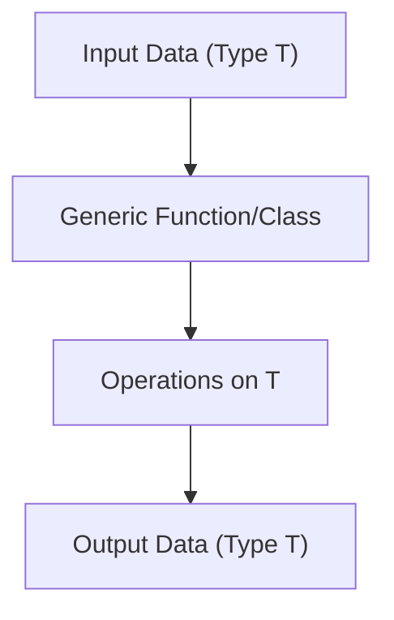

## Generics: Functions, Interfaces, and Classes
### Core Concepts
*   **Generics** in TypeScript provide a way to create reusable components that can work with a variety of types, rather than a single one. They allow you to define functions, interfaces, and classes that operate on a type parameter (a placeholder for a concrete type), enabling:
    *   **Type Safety:** Ensures that types are consistent across different parts of a component.
    *   **Reusability:** Write flexible code that works with different data types without duplication.
    *   **Flexibility:** Adapt components to different data structures and requirements.

### Key Details & Nuances
*   **Generic Functions:**
    *   **Syntax:** Defined with a type parameter `<T>` before the parameter list (e.g., `function identity<T>(arg: T): T { return arg; }`).
    *   **Type Inference:** TypeScript can often infer the type argument based on the values passed.
    *   **Explicit Type Arguments:** Can be provided manually (e.g., `identity<string>("hello")`).
    *   **Type Constraints (`extends`):** Restrict the types that can be used for a generic type parameter (e.g., `function printLength<T extends { length: number }>(arg: T): number { return arg.length; }`). This allows access to properties of the constrained type.
*   **Generic Interfaces:**
    *   **Syntax:** Declare a type parameter when defining the interface (e.g., `interface Box<T> { value: T; }`).
    *   **Usage:** Used to create type-safe data structures that can hold different types of values (e.g., `Box<string>`, `Box<number[]>`).
    *   **Common Examples:** `Array<T>`, `Promise<T>`.
*   **Generic Classes:**
    *   **Syntax:** Declare a type parameter with the class name (e.g., `class Container<T> { constructor(public item: T) {} }`).
    *   **Instance vs. Static:** Type parameters apply to instance properties and methods. Static properties or methods cannot directly reference the class's type parameter `T` because static members belong to the class itself, not an instance.
*   **`keyof` and `typeof` with Generics:**
    *   `keyof T`: Creates a union type of the known, public property names of type `T`. Useful for generic functions that operate on object properties.
    *   `typeof T`: Gets the type of a variable or property.
*   **Type Erasure:** TypeScript generics are a compile-time construct. At runtime, they are "erased," meaning there's no runtime type information about the generic type parameter. This is similar to Java/C# generics but different from C++ templates.

### Practical Examples

#### Generic Function with Constraint
```typescript
/**
 * Retrieves a property from an object, ensuring type safety.
 * @param obj The object to query.
 * @param key The key (property name) to retrieve.
 * @returns The value of the specified property.
 */
function getProperty<T, K extends keyof T>(obj: T, key: K): T[K] {
    return obj[key];
}

interface User {
    id: number;
    name: string;
    email: string;
}

const user: User = { id: 1, name: "Alice", email: "alice@example.com" };

const userName = getProperty(user, "name"); // userName is inferred as string
const userId = getProperty(user, "id");     // userId is inferred as number

// getProperty(user, "address"); // Error: Argument of type '"address"' is not assignable to parameter of type '"id" | "name" | "email"'.
```

#### Generic Interface
```typescript
/**
 * Represents a generic API response structure.
 * @template T The type of data contained within the response.
 */
interface ApiResponse<T> {
    success: boolean;
    data: T | null;
    message?: string;
}

// Example usage:
interface Product {
    id: number;
    name: string;
    price: number;
}

const productResponse: ApiResponse<Product> = {
    success: true,
    data: { id: 101, name: "Laptop", price: 1200 },
};

const errorResponse: ApiResponse<null> = {
    success: false,
    data: null,
    message: "Product not found",
};

const productListResponse: ApiResponse<Product[]> = {
    success: true,
    data: [
        { id: 101, name: "Laptop", price: 1200 },
        { id: 102, name: "Mouse", price: 25 },
    ],
};
```

#### Generic Class
```typescript
/**
 * A simple generic data store.
 * @template T The type of items to store.
 */
class DataStore<T> {
    private items: T[] = [];

    addItem(item: T): void {
        this.items.push(item);
    }

    getItem(index: number): T | undefined {
        return this.items[index];
    }

    getAllItems(): T[] {
        return [...this.items];
    }

    // Static members cannot use the class's type parameter T directly
    // static createEmptyStore(): DataStore<T> { return new DataStore<T>(); } // Error
    static createEmptyStore<U>(): DataStore<U> { // Must define its own type parameter
        return new DataStore<U>();
    }
}

const numberStore = new DataStore<number>();
numberStore.addItem(10);
numberStore.addItem(20);
console.log(numberStore.getItem(0)); // Output: 10

const stringStore = new DataStore<string>();
stringStore.addItem("hello");
stringStore.addItem("world");
console.log(stringStore.getAllItems()); // Output: ["hello", "world"]

const emptyProductStore = DataStore.createEmptyStore<Product>();
emptyProductStore.addItem({ id: 201, name: "Keyboard", price: 75 });
```

#### Generic Function Flow


### Common Pitfalls & Trade-offs
*   **Over-genericization:** Creating components that are too generic can lead to complex type definitions that are hard to read, understand, and maintain, sometimes offering little real-world benefit.
*   **Defaulting to `any`:** Using `any` instead of a generic type parameter defeats the purpose of TypeScript's type safety. While `any` is flexible, it opts out of type checking.
*   **Type Erasure Implications:** Generics exist only at compile-time. You cannot use `instanceof` or `typeof` on a generic type parameter `T` at runtime, as the type information is gone. For runtime type checks, you'd need type guards or pass a runtime type parameter (e.g., a constructor function).
*   **Complexity vs. Reusability:** There's a trade-off between the complexity of generic types (especially with multiple constraints or conditional types) and the reusability they offer. Choose the simplest type definition that meets the need.

### Interview Questions
1.  **When would you choose to use TypeScript Generics over union types or `any`? Provide a scenario.**
    *   **Answer:** Generics are preferred when you need to maintain type relationships and consistency across different parts of a component, ensuring type safety without sacrificing flexibility. Union types allow different types but don't enforce a relationship (e.g., `string | number` doesn't mean the input type is the same as the output type). `any` completely bypasses type checking. Generics are ideal for reusable functions/classes that operate on various data types while preserving their specific types throughout the operation (e.g., an `identity` function or a `Repository<T>` class).

2.  **Explain the purpose of type constraints (`extends`) in TypeScript Generics and provide an example of when you would use them.**
    *   **Answer:** Type constraints (`<T extends SomeType>`) allow you to restrict the types that a generic type parameter can be, ensuring that the generic type has certain properties or methods. This is crucial when your generic logic needs to operate on specific features of the type. For example, a generic function `pluck<T, K extends keyof T>(arr: T[], key: K): T[K][]` uses `keyof T` to ensure that `key` is a valid property name of `T`, enabling safe access to `obj[key]`.

3.  **Describe type erasure in TypeScript generics. What are its practical implications for a developer?**
    *   **Answer:** Type erasure means that TypeScript's generic type information is only available during compilation and is removed during the compilation process (transpiled to JavaScript). At runtime, there's no trace of the generic type parameters. The practical implications are that you cannot use runtime operations like `instanceof` or `typeof` directly on a generic type parameter `T` (e.g., `if (value instanceof T)` would be a runtime error). If runtime type checks are needed, developers must implement explicit type guards or pass a constructor/type information as a separate argument.

4.  **How do Generics contribute to both code reusability and type safety in a large-scale application?**
    *   **Answer:** Generics enhance reusability by allowing developers to write flexible, single implementations (e.g., a generic `List<T>`, a generic `fetch` utility) that work correctly with various data types, reducing redundant code. They contribute to type safety by ensuring that these flexible components operate on specific types in a consistent manner, catching type-related errors at compile-time rather than runtime. This prevents common bugs and improves code maintainability in complex systems.

5.  **Can a generic type parameter of a class be used in a static property or method of that class? Why or why not?**
    *   **Answer:** No, a generic type parameter declared on a class (e.g., `class MyClass<T>`) cannot be directly used in a static property or method of that class. This is because static members belong to the class itself, not to an instance of the class, and they are initialized/defined before any specific type argument for `T` is known. To use a generic type within a static method, the static method itself must declare its own generic type parameter (e.g., `static create<U>(value: U): MyClass<U> { ... }`), which is independent of the class's `T`.