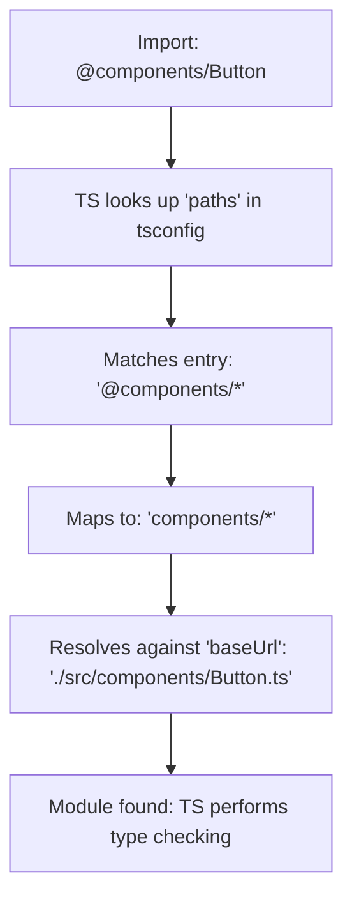

## Module Resolution (`paths` aliasing, `rootDirs`)
### Core Concepts

*   **Module Resolution:** The process by which TypeScript (and JavaScript runtimes/bundlers) determines the actual file path for an `import` or `require` statement. TypeScript performs this at compile-time for type checking and IDE navigation, while runtimes/bundlers do it at runtime/build-time.
*   **`baseUrl`:** A fundamental `tsconfig.json` option that defines the base directory for resolving non-relative module names. All `paths` mappings are resolved relative to this `baseUrl`.
*   **`paths`:** An option within `tsconfig.json` (under `compilerOptions`) that allows you to define custom module resolution mappings. It effectively creates aliases for longer or deeper import paths, improving readability and maintainability, especially in large projects or monorepos.
*   **`rootDirs`:** An advanced `tsconfig.json` option that informs TypeScript that multiple source directories should be treated as one conceptual root. This is particularly useful for projects with complex build outputs, source transformations, or isomorphic codebases where different versions of the "same" module might exist (e.g., client vs. server, or source vs. compiled output).

### Key Details & Nuances

*   **`paths` Usage:**
    *   **Syntax:** `{"@alias/*": ["path/to/actual/folder/*"]}`. The `*` acts as a wildcard.
    *   **Resolution Order:** When resolving an import, TypeScript first tries to match `paths` entries, then falls back to standard Node.js-like module resolution from `baseUrl` if no match.
    *   **Developer Experience:** Significantly reduces "relative path hell" (`../../../`), making imports shorter, more stable, and refactor-friendly.
    *   **Monorepos:** Essential for sharing code between packages without cumbersome `node_modules` symlinks or relative paths.
*   **`rootDirs` Usage:**
    *   **Syntax:** `["./src", "./dist/types"]` (example). These are paths to directories.
    *   **Unified View:** TypeScript considers the contents of all listed `rootDirs` as if they were merged into a single virtual directory. This allows, for example, a declaration file from `./dist/types` to correctly resolve to its implementation in `./src` without explicit pathing.
    *   **Common Use Cases:**
        *   **Isomorphic Code:** When a single module exists in different versions (e.g., browser vs. Node.js implementations), but the same public interface is exposed.
        *   **Build Artifacts:** When compiled output (e.g., `.d.ts` files) needs to be mapped back to their original source files for definition lookup.
*   **Compiler vs. Runtime Resolution:**
    *   **TypeScript (`tsconfig.json`):** Affects type checking, IDE auto-completion, and transpilation output (if using `moduleResolution` settings that affect output paths).
    *   **Runtime/Bundlers:** `paths` and `rootDirs` themselves *do not* directly affect how Node.js or a bundler (like Webpack, Rollup, Vite) resolves modules at runtime. You **must** configure your build tool/runtime environment to mirror these mappings.
    *   **Bundler Configuration:** For `paths`, bundlers typically have their own alias configurations (e.g., Webpack's `resolve.alias`, Babel's `module-resolver` plugin). For `rootDirs`, more complex build setups might be required.
*   **Trade-off:** While simplifying imports, `paths` adds a layer of indirection that can be confusing for newcomers if not well-documented. Misconfigured `paths` can lead to build failures or incorrect runtime behavior.

### Practical Examples

Consider a project structure:

```
my-project/
├── tsconfig.json
├── src/
│   ├── components/
│   │   └── Button.ts
│   ├── utils/
│   │   └── index.ts
│   └── app.ts
├── dist/
│   └── types/
│       └── components/
│           └── Button.d.ts
└── tests/
    └── test-app.ts
```

**`tsconfig.json` Configuration:**

```json
// tsconfig.json
{
  "compilerOptions": {
    "baseUrl": "./src", // Base for non-relative imports and 'paths'
    "paths": {
      "@components/*": ["components/*"], // Alias for src/components
      "@utils": ["utils/index.ts"],     // Alias for a specific file
      "@root/*": ["./*"],               // Alias for anything under src
      "@test/*": ["../tests/*"]         // Alias to go outside baseUrl, resolved relative to tsconfig.json location
    },
    "rootDirs": [
      "./src",         // Source files
      "./dist/types"   // Compiled declaration files
    ],
    "target": "ES2020",
    "module": "ESNext",
    "strict": true,
    "esModuleInterop": true,
    "skipLibCheck": true,
    "forceConsistentCasingInFileNames": true
  },
  "include": ["src/**/*.ts", "tests/**/*.ts"]
}
```

**Import Examples in `src/app.ts`:**

```typescript
// src/app.ts

// Using 'paths' alias
import { Button } from '@components/Button';
import { someUtil } from '@utils'; // resolves to src/utils/index.ts

// Using baseUrl directly (if not matched by paths)
import { Button as OtherButton } from 'components/Button'; // Equivalent to @components/Button in this setup

// Using 'paths' to go outside baseUrl relative to tsconfig.json
import { runTests } from '@test/test-app';

console.log(Button, someUtil, OtherButton, runTests);
```

**Mermaid Diagram: `paths` Resolution Flow**



### Common Pitfalls & Trade-offs

*   **Runtime Mismatch:** The most common pitfall. TypeScript's `paths` only helps at compile-time. If your bundler (Webpack, Rollup, Vite) or Node.js runtime is not configured to mirror these aliases, your application will fail at runtime with "module not found" errors. This requires duplicate configuration.
*   **Over-reliance:** Too many aliases can make it hard to understand the actual file structure by looking at imports. A balance is key.
*   **Ambiguity:** If `paths` aliases overlap or are too broad, TypeScript might resolve to an unexpected file. Specific aliases should generally come before broader ones in the `paths` array.
*   **Performance (Minor):** While not a major performance hit for the TypeScript compiler, complex `paths` or `rootDirs` configurations can slightly increase compilation time, especially in very large codebases. The real performance concern is with bundlers that might struggle with overly complex aliasing.
*   **Debugging:** Debugging module resolution issues can be tricky. Use `tsc --traceResolution` to see how TypeScript is resolving each import, which is invaluable.

### Interview Questions

1.  **What problem do `paths` and `rootDirs` solve in TypeScript, and when would you use them?**
    *   **Answer:** `paths` solves the "relative path hell" problem, providing stable, concise aliases for deep module imports. It improves readability and makes refactoring easier. You'd use it in any medium-to-large project, especially monorepos. `rootDirs` solves the problem of TypeScript needing to understand that multiple physical directories should be treated as a single logical project root, crucial for scenarios like isomorphic codebases (where the "same" file might exist for different environments) or mapping compiled declaration files back to their source implementations for type checking.

2.  **Explain the relationship between `baseUrl`, `paths`, and your bundler's module resolution configuration.**
    *   **Answer:** `baseUrl` is the root from which TypeScript resolves non-relative module paths and against which `paths` mappings are resolved. `paths` defines custom aliases on top of `baseUrl`. Crucially, TypeScript's `paths` configuration is *compile-time/type-checking only*. Your JavaScript bundler (e.g., Webpack, Rollup) or runtime environment (Node.js) needs its *own separate configuration* (e.g., `resolve.alias` in Webpack, `module-resolver` for Babel/Node.js) to understand these aliases and correctly resolve modules at runtime. Without this parallel configuration, the build will succeed, but the application will fail with module not found errors at runtime.

3.  **Describe a scenario where `rootDirs` would be essential, contrasting it with just using `paths`.**
    *   **Answer:** `rootDirs` is essential for isomorphic applications or complex build pipelines. For example, an application might have `src/client` and `src/server` directories, both containing a module named `utils/logger.ts`, but with different implementations. If an isomorphic `shared/api.ts` needs to import `utils/logger`, `rootDirs` allows TypeScript to understand that both `src/client` and `src/server` are valid roots for `utils/logger.ts` based on the current compilation context or target. `paths`, on the other hand, is about creating fixed, alternative names for specific file paths (e.g., `@utils/logger` maps to `src/client/utils/logger.ts`), not about treating multiple roots as a single source for the *same* module name based on context.

4.  **How does TypeScript's module resolution (`paths`, `rootDirs`) impact the final JavaScript bundle and runtime behavior?**
    *   **Answer:** TypeScript's module resolution primarily impacts the *development experience* (type checking, IDE auto-completion, navigation) and the *transpilation phase*. It dictates how TypeScript understands your imports and produces the correct output paths *during compilation*. However, it does *not* directly impact the final JavaScript bundle's content or runtime behavior. For the bundle to correctly resolve these aliases at runtime, the build tool (e.g., Webpack, Rollup) or the runtime environment (e.g., Node.js with a custom module loader) must be configured independently to understand the same `paths` or `rootDirs` mappings. Failure to do so leads to runtime "module not found" errors, as the final JavaScript doesn't carry TypeScript's resolution logic.