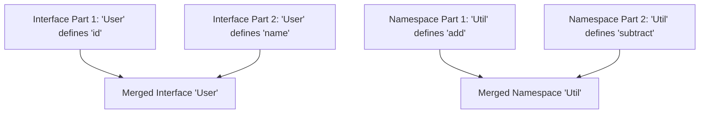

## Declaration Files (`.d.ts`) and Declaration Merging
### Core Concepts
*   **Declaration Files (`.d.ts`):**
    *   Special files in TypeScript that provide **type information (signatures and shapes)** for JavaScript codebases or external libraries.
    *   Enable TypeScript to perform static analysis, type checking, and offer IntelliSense for JS code **without altering its runtime behavior**.
    *   Act as "header files" for JavaScript, describing available modules, functions, variables, and their types.
    *   Crucial for integrating untyped JavaScript libraries into a TypeScript project.
*   **Declaration Merging:**
    *   A TypeScript compiler feature that **merges multiple declarations with the same name** into a single, unified definition.
    *   Applies to:
        *   **Interfaces:** Members are combined.
        *   **Namespaces:** Members and nested namespaces are combined.
        *   **Enums:** Values are combined.
        *   **Functions/Methods:** Signatures are combined into an overload list.
    *   Primarily used for **extending existing types** (e.g., adding properties to a third-party library's interface) without modifying their original source.

### Key Details & Nuances
*   **.d.ts File Types & Usage:**
    *   **Ambient Modules (`declare module 'module-name'`):** Used to declare types for external modules (e.g., non-ESM/CommonJS libraries) or to augment/extend existing npm package modules.
    *   **Ambient Global Declarations (`declare var`, `declare function`, `declare namespace`, `declare global`):** Used to declare types for globally available variables, functions, or objects (e.g., `window` object in browsers, `process` in Node.js).
    *   **Type Definitions for NPM Packages:**
        *   Often distributed via `DefinitelyTyped` (`@types/package-name` in `node_modules`).
        *   Can be bundled directly within the package (specified by `types` or `typings` field in `package.json`).
    *   **Resolution:** TypeScript resolves `.d.ts` files based on `tsconfig.json` settings (`typeRoots`, `types`, `paths`) and `package.json` configurations.
*   **Declaration Merging Rules & Behaviors:**
    *   **Interfaces:**
        *   All non-function members must be unique; otherwise, a type error occurs.
        *   Function members with the same name but different signatures are concatenated into an overload list.
    *   **Namespaces:**
        *   Members (variables, functions, classes, interfaces) from all declarations are combined.
        *   Nested namespaces are also merged recursively.
    *   **Function Overloads:** When merging functions with the same name, later declarations appear *earlier* in the final merged overload list. This order is crucial for overload resolution.
    *   **Classes with Interfaces:** A class and an interface with the same name merge if the interface describes the public members of the class instance. This is more about implementation of an interface by a class than direct "merging" in the typical sense.

### Practical Examples



```typescript
// Example 1: Interface Declaration Merging
interface ServiceConfig {
  baseUrl: string;
}

// Another declaration for ServiceConfig in a different file/scope
interface ServiceConfig {
  timeoutMs: number;
  headers?: Record<string, string>;
}

// Resulting merged 'ServiceConfig' type:
const config: ServiceConfig = {
  baseUrl: "https://api.example.com",
  timeoutMs: 5000,
  headers: { 'X-Auth': 'token' }
};

// Example 2: Module Augmentation (using Declaration Merging to extend an external module)
// Suppose you want to add a 'userId' property to Express's Request object.
// In a file like 'src/types/express.d.ts' or 'global.d.ts':
declare module 'express-serve-static-core' {
  interface Request {
    userId?: string; // Adds an optional userId property to the Request interface
  }
}

// Now in your application code:
import { Request, Response } from 'express';

function loggerMiddleware(req: Request, res: Response, next: Function) {
  req.userId = 'user-123'; // No type error, thanks to module augmentation
  console.log(`Request for user: ${req.userId}`);
  next();
}

// Example 3: Ambient Global Declaration File (e.g., for a legacy global JS library)
// In 'my-legacy-lib.d.ts':
declare namespace LegacyGlobalLib {
  interface Options {
    logLevel: 'info' | 'warn' | 'error';
  }
  function init(options: Options): void;
  const VERSION: string;
}

// In your application .ts file, you can now use it directly:
// LegacyGlobalLib.init({ logLevel: 'info' });
// console.log(LegacyGlobalLib.VERSION);
```

### Common Pitfalls & Trade-offs
*   **Global Pollution:** Overuse of `declare global` can lead to tightly coupled code and make type resolution difficult to reason about. Prefer module augmentation (`declare module`) where possible.
*   **Conflicting Interface Properties:** If two interface declarations with the same name define the *same property* with *different types* (e.g., `foo: string` and `foo: number`), TypeScript will emit a compilation error.
*   **Order of Function Overloads:** When functions are merged, later declarations appear *earlier* in the merged overload list. This can be critical for overload resolution, as TypeScript attempts to match arguments to the *first* compatible signature.
*   **Debugging Type Resolution:** Pinpointing why TypeScript can't find types for a JS library can be challenging. Common causes include missing `@types` packages, incorrect `tsconfig.json` paths (`typeRoots`, `types`, `paths`), or issues within the `.d.ts` files themselves.
*   **Initial Setup Complexity:** While `.d.ts` files simplify *using* untyped JS, creating or extending them for complex libraries can require significant effort and understanding of the library's internal structure.

### Interview Questions
1.  **What is the primary purpose of a `.d.ts` file in TypeScript, and how does it facilitate interoperability with existing JavaScript codebases?**
    *   **Answer:** `.d.ts` files (declaration files) solely provide type definitions (signatures, shapes) for JavaScript code without containing any implementation. Their primary purpose is to allow the TypeScript compiler to understand the types within JS code for static analysis, type checking, and providing rich IntelliSense, effectively bridging the gap between JS and TS while leaving the original JS runtime behavior unchanged.
2.  **Explain TypeScript's concept of Declaration Merging. Provide a practical example of where it would be beneficial in a real-world application.**
    *   **Answer:** Declaration Merging is a mechanism where the TypeScript compiler combines multiple declarations (e.g., interfaces, namespaces, function overloads) that share the same name into a single, unified definition. It's highly beneficial for extending existing types, particularly those from external libraries. A common example is using module augmentation (`declare module 'express-serve-static-core' { interface Request { user?: UserType; } }`) to add a `user` property to Express.js's `Request` interface, allowing your application to use this custom property with full type safety.
3.  **When would you choose to use `declare module 'module-name'` for type augmentation versus `declare global`?**
    *   **Answer:** You use `declare module 'module-name'` when you want to add or modify types *within* a specific existing module (e.g., extending an NPM package's exported types). This keeps the augmentation scoped and modular. You use `declare global` when you need to add or modify types that are globally available (e.g., properties on the `window` object in a browser, or global utility functions). `declare global` should be used sparingly to avoid polluting the global namespace and creating potential naming conflicts.
4.  **How does TypeScript typically locate and resolve `.d.ts` files for external npm packages? What `tsconfig.json` options influence this process?**
    *   **Answer:** TypeScript primarily locates `.d.ts` files for npm packages through:
        1.  The `types` or `typings` field in the package's `package.json`.
        2.  The `node_modules/@types/package-name` directory (for definitions from `DefinitelyTyped`).
    The `tsconfig.json` options that influence this process are:
        *   **`typeRoots`:** Specifies directories to search for type definitions (defaults to `node_modules/@types`).
        *   **`types`:** Lists specific type packages to include (e.g., `["node", "jest"]`), overriding `typeRoots` discovery.
        *   **`paths`:** Used for custom module resolution, which can indirectly point to type declaration files.